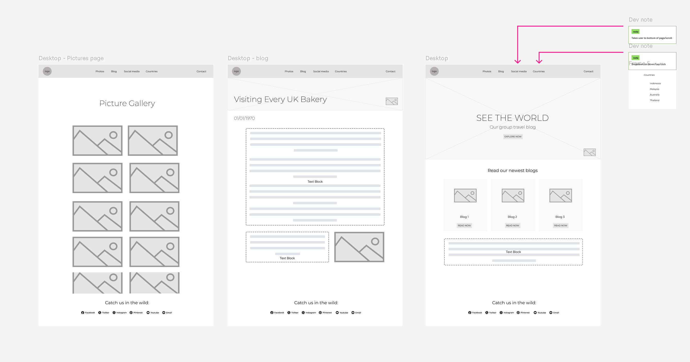
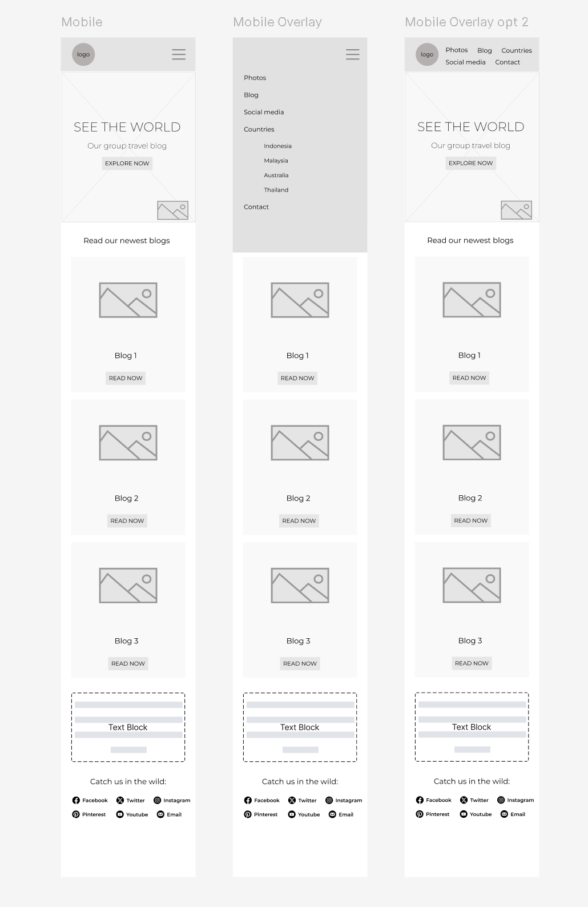

# travel-blog
Code First Girls Introduction to Website Design

# Features and Design

- Multiple Pages
- Working links with scroll and click across all pages
- Three blog pages
- A photos page with dynamically loaded photo modal on click
- Blog pages have reactions using javascript!
- Contact us page
- Use of bootstrap and used the container model to match up with the wireframe
- consistent theme using separate styling css
- Hover effect on links, active links
- Carousel with rotating images, links, and overlaid colour to dull images for easier text reading
- Footer with links to other pages using icons from fabicon and some CSS to match our theme
- Responsive design with stacking on mobile and a hamburger navigation
- Designed theme with specific font and consistent colouring to match travel theme
- Specially designed logo to match travel theme!
- Cards are all a consistent size with buttons aligned with the bottom no matter the image or text used
- Use of github pages, github branching for collaborative development, and github pull requests
- Consideration of UI and UX design with things such as the active underlines

### Wireframe Design: From Design to Implementation

*Desktop wireframe with developer notes to help when implementing*

*Mobile wireframe with responsive design considerations*
